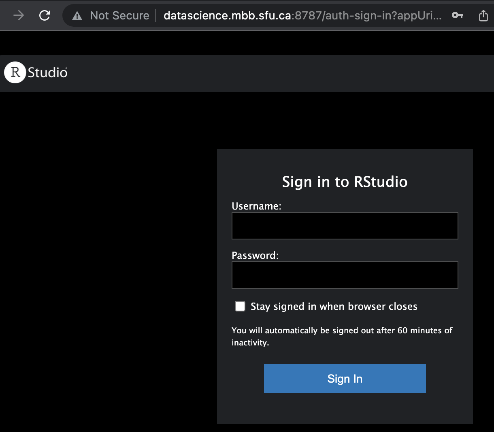

# MBB243 
# Data Analysis for Molecular Biology and Biochemistry

## TL;DR

* This is the course landing page that will host all course materials (instead of Canvas)
* Lecture slides will be posted here after class
* New lab materials will be made available here before each lab
* The structure of the course is summarized below
* Instructions for how to use this repository for your labs are at the [bottom of this page](#Lab-materials-and-server)


## Introduction
The purpose of this introductory data analysis course is to teach students in molecular biology or any students who will analyze molecular data, basic knowledge of molecular biology data types, data analysis methods including basic programming skills using Python, and basic statistics skills using R.

## Location
* **Until further notice, lectures and labs will NOT be held in person**
* Lectures will be held in AQ 4130 (once we resume in-person teaching)
* Labs will be in SSB 6178 (once we resume in-person teaching)

## Grading
* 20% In each lab, there is a list of tasks that should be accomplished in class. Results are submitted by the end of each lab. 
* 35% Lab assignments: For some labs, additional short assignments will be made available in lab sessions and will be due at the start of your lab one week later (unless indicated otherwise). There is a 10% per day late penalty for assignments received after the due date time. 
* 10% In-class midterm exam
* 25% cumulative final exam mixture of multiple choice, short answer and written questions
* 10% Attendance and participation in lecture and lab 

## Schedule

|Week|Date| Lecture topic     | Date| Lab topic | Assignment (# or NA) |
|--|------| ----------- | ------|----------- | ---|
|1|12-01-2022 | Molecular biology data flavours  | 14-01-2022 | Setting up a bash environment, installing software | NA |
|2|19-01-2022 | Genomic data types  | 21-01-2022 | Manipulating and searching text files | 1 |
|3|26-01-2022 | Fundamentals of R and Python | 28-01-2022| Basic data types and operations | NA |
|4|02-02-2022 | Obtaining and manipulating sequence data | 04-02-2022 | Conditionals and control flow | 2 |
|5|09-02-2022 | Regular expressions and patterns | 11-02-2022 | Regular expressions (bash, Python and R) | NA |
|6|16-02-2022 | Quantitative DNA/RNA sequence analysis | 16-02-2022 | Hypothesis testing and summarization | 3 |
|-|23-02-2022 | Reading Week| 23-02-2022| Reading Week | NA |
|7|02-03-2022 | Midterm exam | 04-03-2022 | No lab | NA |
|8|09-03-2022 | Exploratory data analysis in molecular biology | 11-03-2022 | Tidy data, data frames and data tables | NA |
|9|16-03-2022 | Common visualization methods | 18-03-2022 | Cleaning and combining and reformatting data | 4 |
|10|23-03-2022 | Basic modeling | 25-03-2022 | Creating, utilizing, and visualizing models | NA |
|11|30-03-2022 | Methods for enhancing reproducibility | 01-04-2022 | Introduction to Snakemake | 5 |
|12|06-04-2022 | Data analysis pipelines | 08-04-2022 | open lab | 5 (continued) |

## Lab materials and server

### Connecting to Rstudio server

Our labs will ideally be run on the MBB RStudio server. This is a new server that, due to SFU security policies, cannot be accessed directly. Details for how to connect to this server will be added here shortly.





### Accessing/refreshing lab materials each week

The lab materials will be hosted in this GitHub repository. At the start of every lab you will need to "pull" the content from GitHub. Although the approach is likely new to most of you, the process should be straightforward. Learning the basics is a useful skill as you will likely encounter tools in GitHub or other similar version-control systems throughout this course and your studies. 

**In the command line Terminal in Rstudio:**


* One-time setup
```
git clone git@github.com:morinlab/MBB243.git
```
* Every week afterward
```
cd ~/MBB243
git pull
```

## More Resources
* [What is Git and GitHub all about?](https://www.educative.io/blog/git-github-tutorial-beginners)
